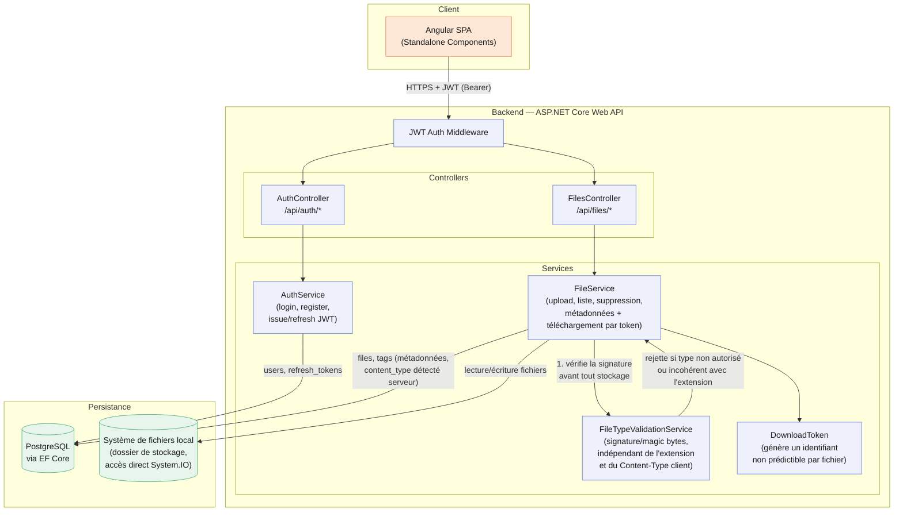

# Schéma d'architecture — DataShare

Client Angular → API ASP.NET Core (middleware JWT, contrôleurs, services) → PostgreSQL (métadonnées) + système de fichiers local (contenu des fichiers). Un fichier expiré reste en base (son `status` calculé passe juste à `expired`) — aucun job de purge physique n'est construit dans ce prototype (voir `MAINTENANCE.md`).

