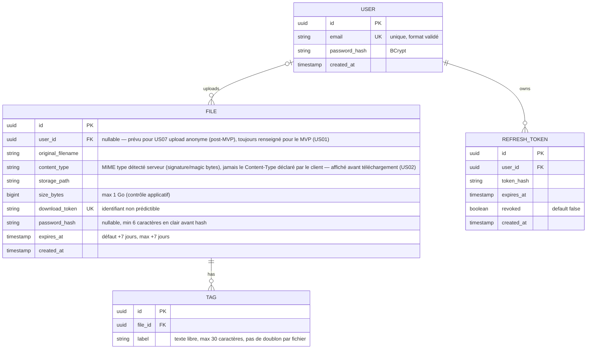

# MCD — DataShare

4 entités : `USER`, `REFRESH_TOKEN`, `FILE`, `TAG`. Base PostgreSQL.

## Pourquoi des UUID plutôt que des ID auto-incrémentés ?

Réponse courte, à pouvoir justifier en soutenance si l'évaluateur challenge ce choix :

- **`FILE.id` et `USER.id` sont exposés via l'API** (`DELETE /api/files/{id}`, historique, réponse d'inscription). Avec un entier auto-incrémenté (1, 2, 3...), n'importe quel utilisateur authentifié pourrait tester `/api/files/1`, `/api/files/2`, etc. et déduire des informations (nombre total de fichiers, volume d'utilisateurs, existence d'une ressource) — même si le contrôle d'autorisation bloque ensuite l'accès. C'est une recommandation de sécurité standard pour toute API publique (mitigation des attaques par énumération / IDOR — *Insecure Direct Object Reference*), indépendante de ce projet précis.
- **`REFRESH_TOKEN.id` et `TAG.id` ne sont jamais exposés directement** (le refresh token expose sa valeur, pas son id de ligne ; les tags sortent en tableau de strings). Un `bigserial` y aurait été tout aussi valable, avec un léger gain de stockage/perf. UUID partout a été choisi pour la **cohérence du schéma** (un seul type d'identifiant dans tout le code EF Core) — pas parce que c'était strictement nécessaire pour ces deux tables.
- **Contrepartie connue** : un UUID (v4, aléatoire — ce que génère `Guid.NewGuid()` par défaut) est plus lourd (16 octets vs 4/8) et fragmente un peu plus l'index B-tree PostgreSQL à l'écriture qu'un entier séquentiel. Négligeable à l'échelle de ce projet (prototype MVP), mais pas gratuit en très gros volume — c'est le compromis à connaître, pas un choix sans inconvénient.
