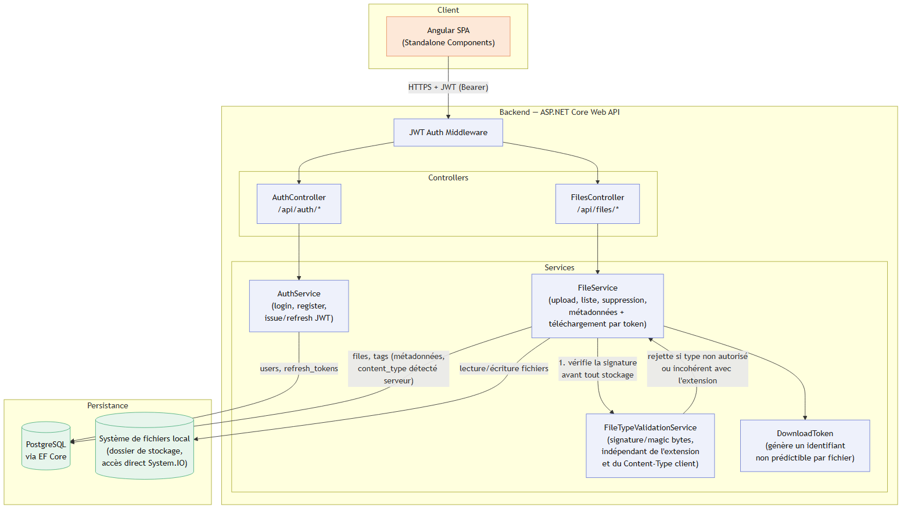
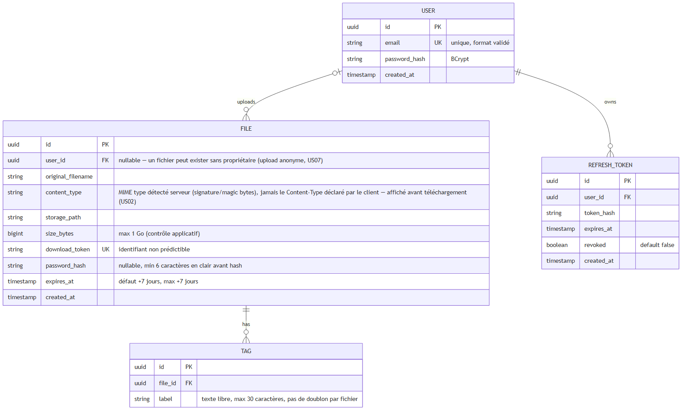

# DataShare — Documentation technique

Document livrable attendu par la spec du projet (voir `.mafal\projet3-datashare\entrants\mission\00-mission-brief.md`, liste des livrables). Assemblé au fil des étapes ; converti en PDF avant dépôt final.

### Sommaire

1. Architecture de l'application
2. Choix technologiques justifiés
3. Modèle de données
4. Documentation des endpoints (API)
5. Sécurité et gestion des accès
6. Qualité, tests et maintenance
7. Processus d'installation et d'exécution
8. Utilisation de l'IA dans le développement

## 1. Architecture de l'application

DataShare suit une architecture 3-tiers classique : un client Angular (SPA), une API REST ASP.NET Core, et une couche de persistance composée de PostgreSQL (métadonnées) et du système de fichiers local (contenu binaire des fichiers).



### Backend — couches

Architecture en couches, sans MVVM (ce n'est pas une application desktop) :

```
backend/
├── src/DataShare.Api/
│   ├── Controllers/     # Endpoints REST (DTOs en entrée/sortie uniquement)
│   ├── Services/        # Logique métier (interfaces + implémentations)
│   ├── Models/           # Entités EF Core
│   ├── DTOs/             # Objets de transfert (requêtes/réponses API)
│   ├── Exceptions/       # Exceptions métier dédiées, une par cas de rejet
│   ├── Middleware/       # Gestion d'erreurs, authentification JWT
│   └── Program.cs
└── tests/
    ├── DataShare.UnitTests/         # MSTest, EF Core InMemory
    └── DataShare.IntegrationTests/  # MSTest, vraie base Postgres dédiée
```

- Pas de logique métier dans les contrôleurs — ils délèguent systématiquement aux services.
- Pas de couche `Repositories` séparée : les services injectent `AppDbContext` directement (choix assumé — pour la taille de ce projet, une couche repository par-dessus EF Core n'apporte pas grand-chose ; `DbContext`/`DbSet<T>` fait déjà office de repository + unit-of-work). Testabilité assurée via le provider EF Core InMemory plutôt que par mock de repository.
- Accès direct au système de fichiers (`System.IO`) depuis `FileService`, sans couche d'abstraction supplémentaire — cohérent avec le choix de stockage local assumé pour ce MVP (voir section 2).
- Requêtes paramétrées uniquement (EF Core LINQ), jamais de concaténation SQL.
- Nullable reference types activés (`<Nullable>enable</Nullable>`).

### Frontend — organisation

```
frontend/src/app/
├── core/                # Transversal, organisé par type technique (pas par feature)
│   ├── guards/           # authGuard, guestGuard
│   ├── interceptors/     # Attache le JWT à chaque requête HTTP
│   ├── models/           # Interfaces TypeScript (contrats API)
│   └── services/         # AuthService, FileService
├── components/           # Un dossier par écran (login, register, upload, mon-espace, download)
├── shared/header/        # Composant partagé, affiché sur toutes les pages sauf Mon espace
└── app.component.ts
```

- Pas de couche `features/`/`shared/` intermédiaire au-delà de `header/` — structure plate `components/<écran>/`, plus lisible pour le périmètre de ce projet.
- Composants standalone (pas de NgModules), routes lazy-loadées (`loadComponent`).
- `OnPush` change detection.
- La page "Mon espace" masque le header global (route data `hideHeader`) car elle porte son propre bandeau, intégré à sa sidebar, conformément à la maquette Figma.

## 2. Choix technologiques justifiés

| Élément | Technologie choisie | Alternatives (imposées par la spec) | Justification |
|---|---|---|---|
| Langage / framework back-end | C# / .NET 8, ASP.NET Core Web API | Java/Spring Boot, TypeScript/NestJS, PHP (Symfony/Laravel) | Stack déjà maîtrisée par le développeur — réduit le risque d'implémentation sur un planning contraint de 4 semaines. ASP.NET Core figure parmi les frameworks web les plus performants du marché (benchmarks TechEmpower), avec un typage fort et Entity Framework Core comme ORM mature pour l'accès aux données. |
| Framework front-end | Angular 17+ (Standalone Components) | React, VueJS | Framework « complet » (routing, formulaires, client HTTP, injection de dépendances intégrés nativement), plus structurant que React/Vue qui nécessitent d'assembler ces briques soi-même — pertinent pour un objectif de montée en compétence sur des projets de grande taille. Déjà utilisé sur le projet OpenClassrooms précédent (« Testez et améliorez une application existante », application EtuBibliothèque), ce qui capitalise sur une compétence en cours d'acquisition plutôt que d'en disperser l'effort sur un nouveau framework. |
| Base de données | PostgreSQL | MongoDB | SGBD relationnel open-source le plus utilisé en entreprise. Le domaine métier (utilisateurs, fichiers, tags, tokens de rafraîchissement) est naturellement relationnel, avec des relations et cardinalités bien définies (voir section 3) — un SGBD NoSQL document-orienté n'apporterait aucun bénéfice ici et compliquerait la modélisation sans contrepartie. |
| Stockage des fichiers | Système de fichiers local | Stockage AWS S3 | Plus simple à mettre en œuvre pour un prototype MVP à livrer en 4 semaines : aucun compte ni identifiants cloud à gérer, aucun coût. L'accès disque reste isolé dans `FileService`, ce qui limiterait la surface à modifier pour basculer vers S3 plus tard. |
| Authentification | JWT — access token court + refresh token | Sessions serveur classiques, authentification déléguée (OpenID Connect / Google) | Conforme à la spec (US03/US04, « Authentification JWT » dans les bonnes pratiques attendues). Le refresh token est ajouté au-delà du strict minimum demandé, pour permettre la révocation d'une session sans attendre l'expiration de l'access token. L'authentification déléguée (Google) a été envisagée puis écartée : la spec attend explicitement une création de compte et une connexion par email/mot de passe propres à l'application. |
| Tests back-end | MSTest + Coverlet | xUnit + FluentAssertions + Moq | MSTest est le framework de test officiel de l'écosystème .NET, nativement intégré à Visual Studio ; Coverlet fournit la couverture de code via `dotnet test --collect:"XPlat Code Coverage"`. |
| Tests unitaires front-end | Jest (`jest-preset-angular`) | Karma/Jasmine (outillage historique d'Angular CLI) | Cohérence avec le projet précédent (EtuBibliothèque), qui utilise déjà Jest — évite d'introduire un deuxième outil de test à maîtriser pour un même type de besoin. |
| Tests end-to-end | Cypress | Playwright | Explicitement suggéré par la spec (« Cypress ou équivalent ») et déjà utilisé sur le projet précédent (EtuBibliothèque) — cohérence retenue plutôt que d'introduire un nouvel outil. |
| Test de performance | k6 | Apache JMeter, Artillery | Explicitement suggéré par la spec (« k6 ou autre outil de performance »). Scripts en JavaScript, binaire unique sans JVM contrairement à JMeter, bien adapté à un test ciblé sur un seul endpoint critique plutôt qu'à une suite de charge complexe. |
| Intégration continue | GitHub Actions | GitLab CI | Le code est hébergé sur GitHub (organisation dédiée à la formation) ; Actions s'intègre nativement, sans outil ni compte supplémentaire à configurer. |
| Qualité de code | SonarQube, ESLint (front), .NET Analyzers (back) | — | Détection automatisée des bugs, vulnérabilités et code smells à chaque build. |
| Gestion de version | Git / GitHub, branches `main` et `develop` protégées (GitHub Rulesets), Conventional Commits | Ancienne API GitHub « Branch Protection » | Conforme à la spec (historique Git propre, norme Conventional Commits). Les Rulesets sont préférés car ils permettent un contournement admin exclusivement via Pull Request — jamais de push direct, même pour un compte administrateur. |

### Points de vigilance assumés

- Le stockage local et l'usage d'UUID plutôt que d'identifiants auto-incrémentés (voir section 3) sont des compromis documentés, pas des choix « par défaut » : chacun a une alternative connue et une raison explicite de ne pas l'avoir retenue à ce stade.
- **Gestion des secrets locaux** : le mot de passe PostgreSQL dans `docker-compose.yml` (conteneur local, sans donnée réelle, non exposé) reste en clair — pratique standard et à risque quasi nul en développement local. La chaîne de connexion utilisée par l'API .NET, elle, **n'est jamais commitée** : elle passe par `dotnet user-secrets` (voir section 7), le mécanisme officiel .NET conçu pour ça.
- Détail complet du raisonnement : [`docs/adr/0001-stack-technique.md`](adr/0001-stack-technique.md) et [`docs/adr/0002-validation-type-fichiers.md`](adr/0002-validation-type-fichiers.md).

### Portée du front-end : web uniquement pour le MVP

Les maquettes Figma fournies couvrent à la fois des écrans mobile (iPhone) et desktop/web. **Le MVP cible uniquement le web** — l'application Angular est développée et validée pour un usage navigateur desktop, avec un responsive fonctionnel mais sans refonte mobile dédiée (menu hamburger, avatar+nom — voir `MAINTENANCE.md`). Les écrans mobile de la maquette servent de référence pour une évolution ultérieure, pas d'objectif de livraison pour ce MVP.

## 3. Modèle de données

4 entités, base PostgreSQL via Entity Framework Core :



### Pourquoi `FILE.user_id` est nullable

Un fichier peut exister **sans** propriétaire : c'est l'upload anonyme (US07). Ce n'est pas une fonctionnalité construite dans ce MVP (classée « avancée/optionnelle » par la spec), mais le MCD représente le **domaine métier réel**, pas le périmètre de la première livraison :

- **MCD** = ce que les données représentent conceptuellement, selon la spec complète (US01 à US10).
- **API v1 / code** = ce qu'on construit en premier. Le code applicatif actuel n'écrit jamais de fichier avec `user_id` vide — mais ça n'a aucune raison de changer le MCD, qui reste correct et prêt si US07 est ajoutée plus tard sans migration de schéma.

### Pourquoi des UUID plutôt que des identifiants auto-incrémentés

- `FILE.id` et `USER.id` sont exposés via l'API (`DELETE /api/files/{id}`, historique, réponse d'inscription). Avec un entier auto-incrémenté, n'importe quel utilisateur authentifié pourrait tester `/api/files/1`, `/api/files/2`, etc. et déduire des informations (nombre total de fichiers, volume d'utilisateurs) — même si le contrôle d'autorisation bloque ensuite l'accès. C'est une recommandation de sécurité standard pour toute API publique (mitigation des attaques par énumération / IDOR).
- `REFRESH_TOKEN.id` et `TAG.id` ne sont jamais exposés directement. Un `bigserial` y aurait été tout aussi valable ; UUID partout a été choisi pour la cohérence du schéma (un seul type d'identifiant dans tout le code EF Core), pas par nécessité stricte pour ces deux tables.
- **Contrepartie connue** : un UUID v4 (aléatoire) est plus lourd (16 octets vs 4/8) et fragmente un peu plus l'index B-tree PostgreSQL à l'écriture qu'un entier séquentiel — négligeable à l'échelle de ce prototype.

## 4. Documentation des endpoints (API)

Contrat complet au format OpenAPI 3.0 : [`docs/api/openapi.yaml`](api/openapi.yaml) (également explorable via Swagger UI, `/swagger` en développement). Synthèse :

| Endpoint | Méthode | Auth | Description |
|---|---|---|---|
| `/api/auth/register` | POST | — | Création de compte (US03) |
| `/api/auth/login` | POST | — | Connexion, renvoie access + refresh token (US04) |
| `/api/auth/refresh` | POST | — | Échange un refresh token valide contre un nouveau couple de tokens |
| `/api/auth/logout` | POST | JWT | Révoque le refresh token courant |
| `/api/files` | POST | JWT | Upload d'un fichier, mot de passe et expiration optionnels (US01) |
| `/api/files` | GET | JWT | Liste des fichiers de l'utilisateur, filtrable par statut (US05) |
| `/api/files/{id}` | DELETE | JWT | Suppression d'un fichier (US06) |
| `/api/files/download/{token}` | GET | — | Métadonnées d'un fichier avant téléchargement, accessible sans compte (US02) |
| `/api/files/download/{token}` | POST | — | Téléchargement effectif (flux binaire), mot de passe optionnel (US02) |

Toutes les réponses d'erreur suivent un format uniforme (`ErrorResponse { message, code }`), avec un `code` distinct par cas de rejet métier (ex. `WEAK_FILE_PASSWORD`, `FILE_ACCESS_FORBIDDEN`, `FILE_NOT_FOUND_OR_EXPIRED`) — le frontend s'appuie sur ce code, jamais sur le texte du message, pour adapter son affichage.

## 5. Sécurité et gestion des accès

Détail complet et justifications : [`SECURITY.md`](../SECURITY.md) (document vivant, enrichi au fil du projet). Points clés :

### Authentification

- **Rotation des refresh tokens + détection de réutilisation** : chaque refresh token n'est utilisable qu'une seule fois. Un refresh token déjà révoqué présenté à nouveau est interprété comme un signal de vol, et déclenche la révocation de **tous** les refresh tokens de l'utilisateur concerné.
- **Mots de passe** : hashés avec BCrypt (compte utilisateur ET mot de passe optionnel de fichier), jamais stockés en clair.
- **Stockage des tokens côté client** : `localStorage`, attaché manuellement via un intercepteur HTTP — alternative au cookie `httpOnly` explicitement documentée et écartée pour ce prototype (voir `SECURITY.md` pour les trois raisons concrètes).

### Upload et gestion des fichiers

- **Validation du type réel par signature binaire** (magic bytes, bibliothèque Mime-Detective) — jamais l'extension ni le `Content-Type` déclarés par le client, tous deux trivialement falsifiables (voir ADR 0002).
- **Identité de l'uploadeur lue depuis le JWT**, jamais depuis le body client — une première version du code acceptait un champ `UserId` dans le formulaire, repérée et corrigée en revue avant merge.
- **Nom de fichier sur disque = token de téléchargement**, jamais le nom original — évite toute traversée de chemin (`../`) et les collisions entre deux fichiers de même nom.
- **Mot de passe de fichier = contrôle d'accès, pas chiffrement** : le contenu du fichier n'est jamais chiffré sur disque, seul l'accès via l'API est protégé par vérification BCrypt. Documenté explicitement comme une limite assumée pour ce MVP, pas un oubli.

### Historique, liste et suppression (IDOR)

- **`DELETE /api/files/{id}` vérifie l'appartenance côté serveur** (comparaison `UserId` du fichier vs claim `sub` du JWT) avant toute suppression — 403 si non-correspondance, jamais 404. Même repéré et corrigé en revue avant merge qu'à l'upload : une première version supprimait directement par id sans vérifier le propriétaire, ce qui aurait permis à n'importe quel utilisateur authentifié de supprimer le fichier de n'importe qui d'autre (IDOR — *Insecure Direct Object Reference*).
- **Le lien de téléchargement ne révèle jamais si un token a existé mais est expiré** : message générique identique pour un token inconnu et pour un fichier expiré, jamais de distinction observable — même logique que l'énumération de comptes évitée côté authentification.

## 6. Qualité, tests et maintenance

Détail complet : [`TESTING.md`](../TESTING.md), [`MAINTENANCE.md`](../MAINTENANCE.md), [`PERF.md`](../PERF.md).

### Plan de tests (synthèse)

| Fonctionnalité critique | Type de test | Critère d'acceptation |
|---|---|---|
| Inscription / connexion / rafraîchissement de session | Unitaire + intégration + E2E | Chaque branche d'erreur métier testée séparément ; révocation en cascade vérifiée contre une vraie base |
| Upload d'un fichier | Unitaire + intégration + E2E + charge (k6) | Chaque cas de rejet (taille, expiration, mot de passe, type) testé ; p95 < 500ms sous charge |
| Liste et filtrage des fichiers (Mon espace) | Unitaire + intégration + E2E | Filtre par utilisateur et par statut vérifié, y compris qu'un utilisateur ne voit jamais les fichiers d'un autre |
| Suppression d'un fichier | Unitaire + intégration + E2E | IDOR testé explicitement (403 si non-propriétaire), succès vérifié en base ET sur disque |
| Téléchargement public par lien | Unitaire + intégration + E2E | Token inconnu/expiré, mot de passe manquant/incorrect, contenu réellement transmis |

### Résultats

- **Backend** : 64 tests unitaires (MSTest + Moq + EF Core InMemory) + 16 tests d'intégration (`WebApplicationFactory`, vraie base Postgres dédiée) — 0 échec.
- **Frontend** : 60 tests Jest — couverture 88,3% (objectif spec : 70%).
- **End-to-end** : 9 scénarios Cypress, exécutés contre le backend et le frontend réellement démarrés.
- **Scan de sécurité** : voir `SECURITY.md` pour le détail des décisions ; `npm audit` (frontend) et l'équivalent .NET à documenter au fil de l'eau.
- **Performance** : test de charge k6 sur `POST /api/files` — p95 = 335ms sur un fichier réel de 2 Mo (seuil 500ms), 0% d'échec sur 117 itérations. Budget Angular CLI vérifié à chaque build production : bundle initial 77 Ko compressé (seuil d'alerte 500 Ko, seuil d'erreur 1 Mo).
- **Logs structurés** : chaque requête HTTP chronométrée en continu (Serilog), en complément du test de charge ponctuel.

### Maintenance

Écarts connus et assumés, documentés dans `MAINTENANCE.md` plutôt que laissés silencieux :
- Purge physique des fichiers expirés : pas encore implémentée (un fichier expiré reste en base, son statut calculé change).
- Purge des refresh tokens révoqués/expirés : pas encore implémentée, plusieurs options d'implémentation évaluées (`BackgroundService` natif, job planifié externe).
- Avatar utilisateur (initiales plutôt que photo + prénom/nom) et layout mobile (responsive plutôt que refonte dédiée) : écarts assumés avec la maquette Figma, hors périmètre des US du brief.

## 7. Processus d'installation et d'exécution

### Prérequis

- .NET 8 SDK, Node.js (LTS), Docker (pour PostgreSQL local).

### Backend

```bash
# Démarrer PostgreSQL (depuis la racine du repo)
docker compose up -d

# Configuration locale (une seule fois) - la chaîne de connexion n'est jamais commitée
cd backend/src/DataShare.Api
dotnet user-secrets set "ConnectionStrings:DataShare" \
  "Host=localhost;Port=5432;Database=datashare;Username=datashare;Password=datashare_dev_only"

# Lancer l'API
cd backend
dotnet restore
dotnet run --project src/DataShare.Api
```

Swagger UI disponible sur `/swagger` en développement, health check sur `/health`.

### Frontend

```bash
cd frontend
npm install
ng serve
```

Application disponible sur `http://localhost:4200`.

### Tests

```bash
# Backend - unitaires
cd backend && dotnet test tests/DataShare.UnitTests

# Backend - intégration (nécessite une base dédiée, à créer une seule fois)
docker exec -i datashare-postgres psql -U datashare -d datashare \
  -c "CREATE DATABASE datashare_integration_test;"
dotnet test tests/DataShare.IntegrationTests

# Frontend - unitaires
cd frontend && npm test

# Frontend - end-to-end (backend + frontend doivent tourner)
npx cypress run
```

### Déploiement / CI

Intégration continue via GitHub Actions (lint, build, tests unitaires, tests d'intégration avec service Postgres éphémère, tests e2e Cypress avec backend réellement démarré) à chaque Pull Request. Voir `.github/workflows/`.

## 8. Utilisation de l'IA dans le développement

Un assistant IA (Claude Code) a été utilisé comme copilote actif tout au long du développement de ce projet, au-delà du quota d'une seule User Story initialement prévu par le brief — choix assumé, expliqué ci-dessous plutôt que masqué.

### Ce qui a été fait concrètement

- **Pilotage actif, pas délégation aveugle** : les tâches confiées à l'IA étaient précisées explicitement (ex. « implémente `DeleteAsync` avec vérification du propriétaire »), jamais un simple « fais l'US ». Chaque changement a été relu avant merge, y compris le code déjà généré par l'IA elle-même sur une itération précédente.
- **Relecture disciplinée, pas symbolique** : plusieurs bugs réels ont été trouvés en revue avant merge, pas laissés passer jusqu'en production — l'exemple le plus significatif est l'IDOR sur la suppression de fichiers (section 5) : une première version de `DeleteAsync` ne vérifiait pas le propriétaire du fichier, repérée en relecture et corrigée avant merge.
- **Vérification systématique, pas déclarative** : chaque fonctionnalité a été vérifiée réellement avant d'être considérée terminée — build, suite de tests complète, et pour l'interface, comparaison visuelle directe (captures d'écran) avec la maquette Figma plutôt qu'une simple relecture du code généré.
- **Guides d'implémentation plutôt que code, sur certaines parties** : au démarrage du projet, l'approche retenue était de limiter l'IA à une seule US au sens strict du brief, et de produire à la place des guides méthodologiques (sans code) pour les autres User Stories, laissées à une implémentation manuelle. Cette approche a évolué en cours de projet vers un pilotage actif plus large, documenté ici plutôt que présenté comme une conformité stricte au quota initial.

### Bénéfices observés et limites

- **Bénéfice** : vélocité significative sur le code répétitif et à fort volume — tests unitaires/intégration (paramétrés, nombreux cas d'erreur à couvrir), scaffolding de composants Angular, documentation technique.
- **Limite assumée** : la vélocité ne remplace pas la relecture. Plusieurs incidents concrets de cette nature ont été rencontrés et documentés au fil du projet : le bug IDOR déjà cité, une confusion initiale entre « mot de passe de fichier » et « chiffrement du contenu » (clarifiée avant de devenir un vrai problème de sécurité perçue), ou encore une comparaison visuelle d'interface qui a révélé que le premier rendu ne correspondait pas du tout à la maquette malgré un code apparemment conforme à sa description textuelle.
- **Conclusion pratique** : l'IA a été traitée comme un contributeur rapide mais nécessitant une supervision constante, pas comme un substitut à la compréhension du code produit — condition nécessaire pour pouvoir expliquer et défendre chaque choix technique en soutenance.
